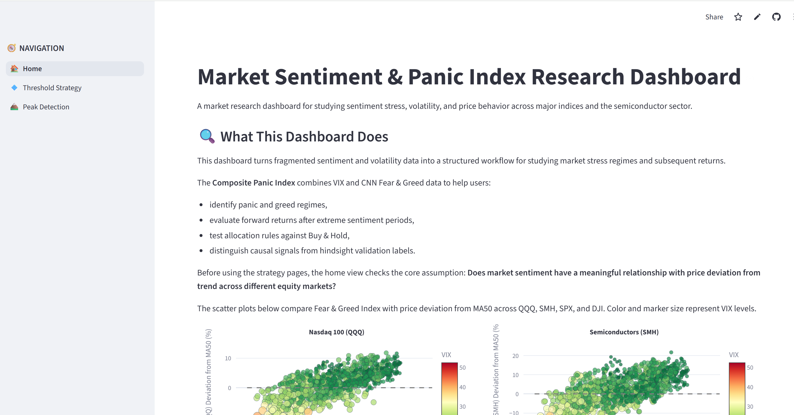
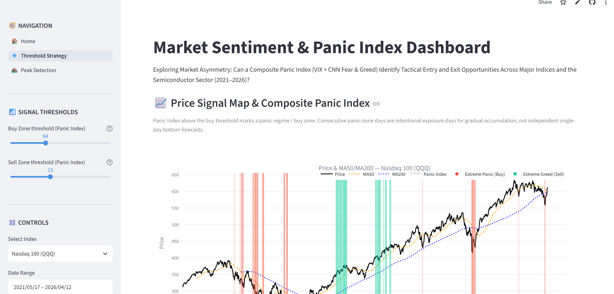
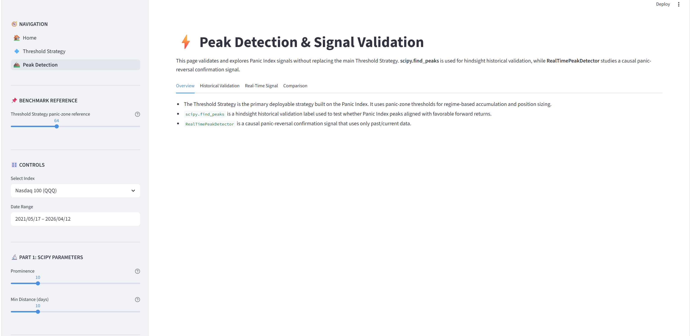

# Market Sentiment & Panic Index Dashboard

Repository: `Yiting0210/panic-index-dashboard`

> **Exploring Market Asymmetry**: Can a Composite Panic Index (VIX + CNN Fear & Greed) identify tactical entry and exit opportunities across major indices and the Semiconductor sector (2021-2026)?

**Live Demo**: https://panic-index-dashboard-rpbcjhdyxbvfcbk39h6gbw.streamlit.app/

---

## Overview

This Streamlit dashboard studies whether extreme sentiment regimes contain **asymmetric tactical information** across QQQ, SMH, SPX, and DJI.

The project is built around a **Composite Panic Index**, combining VIX and CNN Fear & Greed data. The research thesis is intentionally asymmetric:

- **Panic-side extremes** are studied primarily as accumulation / tactical entry regimes.
- **Greed-side extremes** are evaluated more cautiously because optimistic sentiment can persist during sustained bull markets.
- Greed-side signals are therefore treated as risk-warning / de-risking candidates, not as equally reliable symmetric opposites of panic-side accumulation signals.

The dashboard separates threshold strategy research, exposure diagnostics, forward-return analysis, hindsight peak validation, and causal panic-reversal confirmation.

**Key Finding**: In this historical sample, extreme panic regimes were more consistently associated with favorable medium-term forward returns, while extreme greed was less reliable as an immediate exit signal during sustained bull markets. This is historical regime evidence, not guaranteed alpha.

---

## Screenshots

### Home Page



### Threshold Strategy



### Peak Detection & Signal Validation



---

## Features

- **Threshold Strategy**: causal, backtestable research framework using Panic Index threshold regimes.
- **Deterministic Research Summary**: rule-based interpretation of current regime, backtest results, exposure diagnostics, and attribution outputs without using an LLM API.
- **Strategy Diagnostics**: Average Exposure and Time Below Full Exposure to explain participation versus Buy & Hold.
- **Exposure Trade-off Attribution**: separates arithmetic upside drag from downside cushion using lagged effective exposure consistent with backtest timing.
- **Backtest Performance**: total return, maximum drawdown, Sharpe Ratio, and Calmar Ratio using canonical project metric calculations.
- **Forward Return Analysis**: historical return distributions and summaries after panic and greed observations.
- **scipy.find_peaks Historical Validation**: hindsight labels used to evaluate whether Panic Index peaks historically aligned with favorable forward returns.
- **RealTimePeakDetector Causal Signal Analysis**: past/current-data-only panic-reversal confirmation signal for tactical research.
- **Interactive Controls**: market selector, date range, thresholds, position sizing, horizons, and peak-detection parameters.

---

## Product Case Study

### Target Users

- **ETF investors** who want a structured way to study extreme sentiment regimes without relying on a single indicator.
- **Market research analysts** comparing sentiment conditions with subsequent market behavior.
- **Risk-aware portfolio builders** evaluating accumulation rules, exposure changes, and drawdown tradeoffs.
- **Quantitative researchers** comparing hindsight validation methods with causal signal-generation logic.

### User Problem

Market sentiment data is fragmented and easy to overinterpret. VIX captures expected volatility, while CNN Fear & Greed represents a broader sentiment regime; neither indicator alone provides a complete decision framework.

The product problem is to separate regime identification from short-term prediction, causal/backtestable rules from hindsight validation, and historical relationships from guaranteed trading performance.

### Product Solution

The dashboard turns VIX and CNN Fear & Greed data into a Composite Panic Index and presents it through two research workflows:

- **Threshold Strategy**: a causal, backtestable allocation research workflow based on Panic Index regimes, exposure behavior, performance metrics, diagnostics, and deterministic interpretation.
- **Peak Detection & Signal Validation**: a research workflow for hindsight historical validation and causal panic-reversal signal analysis.

The dashboard intentionally separates **performance measurement**, **behavioral diagnostics**, **attribution**, and **interpretation**. This makes the research workflow more explainable, auditable, and safer to review.

### Key Workflows

1. Observe the current Panic Index regime.
2. Evaluate threshold-based exposure behavior.
3. Compare strategy performance with Buy & Hold.
4. Diagnose average exposure and time below full exposure.
5. Inspect the trade-off between uncaptured upside and downside cushion.
6. Interpret the results through a deterministic Research Summary.
7. Compare hindsight peak labels with causal confirmation signals on the validation page.

This is a research dashboard, not a live trading recommendation engine.

### Success Metrics

- Forward-return distributions after panic and greed regimes.
- Maximum drawdown relative to Buy & Hold.
- Signal frequency and stability across market periods.
- Consistency across QQQ, SMH, SPX, and DJI.
- Interpretability of signal logic.
- Clear separation between causal rules, hindsight validation, diagnostics, and attribution.

---

## Composite Panic Index

```text
vix_norm    = (VIX - VIX_min) / (VIX_max - VIX_min) x 100
fg_fear     = 100 - Fear_Greed_Score
panic_index = vix_norm x 0.5 + fg_fear x 0.5
```

| Regime | Threshold | Research Interpretation |
|--------|-----------|-------------------------|
| Panic Zone | Panic Index > 64 | Accumulation / exposure-increase regime |
| Greed / Risk-Warning Zone | Panic Index < 15 | Exploratory de-risking candidate |
| Neutral Zone | Between thresholds | No new threshold-driven exposure change |

---

## Signal Design

The dashboard separates the Panic Index signal from the ways it can be studied:

- **Threshold Strategy**: a causal, backtestable allocation research framework. The current implementation mechanically increases exposure in panic regimes and reduces exposure in greed regimes. The diagnostics then evaluate whether that greed-side de-risking design creates useful downside protection or prolonged underexposure.
- **Panic Zone**: studied primarily as an accumulation / exposure-increase regime. Panic-zone observations are exposure days, not independent one-day bottom forecasts.
- **Greed / Risk-Warning Zone**: evaluated as a de-risking candidate. Historical results suggest that immediate greed-side reduction can create prolonged underexposure during sustained advances, so greed is not framed as a symmetric opposite of panic.
- **Neutral Zone**: no new threshold-driven exposure change is indicated; exposure follows the strategy state logic.
- **scipy.find_peaks**: a hindsight historical validation label. It uses the full historical series to identify local maxima after the fact, so it should not be interpreted as a live trading signal.
- **RealTimePeakDetector**: a causal panic-reversal confirmation signal. It only uses past/current data, waiting for panic to spike and then retreat before flagging a signal.

---

## Strategy Diagnostics

The Threshold Strategy page includes compact diagnostics that explain *why* the strategy differs from Buy & Hold.

### Average Exposure

Mean strategy exposure over the selected backtest period.

### Time Below Full Exposure

Share of observations where strategy exposure is below 100%.

These diagnostics matter because a strategy can reduce drawdown partly by reducing market participation. They help distinguish downside protection from the cost of persistent underexposure.

---

## Exposure Trade-off Attribution

The dashboard includes an accounting view of the trade-off created by reduced exposure.

### Underexposed Upside Drag

Arithmetic sum of positive market returns not fully captured because effective exposure was below 100%:

```text
upside_drag_t = max(market_return_t, 0) x max(1 - effective_exposure_t, 0)
```

### Underexposed Downside Cushion

Arithmetic sum of negative market-return magnitude avoided because effective exposure was below 100%:

```text
downside_cushion_t = max(-market_return_t, 0) x max(1 - effective_exposure_t, 0)
```

### Net Arithmetic Trade-off

```text
net_tradeoff = upside_drag - downside_cushion
```

### Largest Underexposed Upside Episode

The continuous below-full-exposure interval with the largest accumulated upside drag.

Attribution uses **lagged effective exposure** to match backtest timing:

```text
strategy_return_t = market_return_t x position_{t-1}
```

This attribution is arithmetic and does not exactly reconcile to compounded total-return differences. It is a diagnostic accounting view, not a causal estimate. Dashboard observation periods may include interpolated non-trading rows under the current data pipeline.

---

## Research Summary

The Research Summary is a deterministic, rule-based interpretation layer. It reads structured analytics outputs and produces a concise paragraph covering:

- current Panic Index regime,
- strategy versus Buy & Hold performance,
- exposure diagnostics,
- optional exposure trade-off attribution,
- cautious interpretation and next diagnostic step.

It does not call an LLM API and does not provide investment advice. The goal is explainable interpretation from reproducible analytics outputs, not AI-generated trading guidance.

---

## Methodology Design Choices

Several methodology choices are intentional tradeoffs for a historical research dashboard:

- **Full-sample VIX normalization**: VIX is normalized using the full historical sample to place the 2021-2026 period on one comparable 0-100 scale. This is useful for retrospective analysis and visual comparability, but it is not strict live signal construction.
- **Interpolation for dashboard continuity**: Missing price and VIX values around weekends or market holidays are linearly interpolated to keep the static dataset and visualizations continuous. A stricter analytics pipeline could separate display-smoothed data from trading-day-only analytical data.
- **Overlapping observations**: Consecutive panic-zone days are expected because the Threshold Strategy models gradual accumulation during sustained stress regimes. Forward-return summaries should be interpreted as regime-conditioned observations, not independent trade-level experiments.
- **Threshold Strategy interpretation**: Thresholds define panic and greed regimes for accumulation / risk-warning research. They are not designed to predict exact market bottoms or tops.
- **Attribution interpretation**: Exposure attribution is arithmetic, uses lagged exposure, and should be read as diagnostic evidence rather than a compounded performance reconciliation.
- **Future live-deployment calibration**: For strict live deployment, the Panic Index should use fixed, rolling, or expanding VIX normalization and explicit trading-day execution assumptions.

---

## Tech Stack

| Layer | Technology |
|-------|------------|
| Frontend | Streamlit |
| Visualization | Plotly |
| Data | Static CSV/Excel-style data files |
| Language | Python 3.12 |
| Deployment | Streamlit Community Cloud |

---

## Project Structure

```text
panic-index-dashboard/
|-- Home.py                         # Streamlit Cloud entry point and home page
|-- pages/
|   |-- 1_💠_Threshold_Strategy.py   # Threshold strategy, diagnostics, attribution, backtest UI
|   |-- 2_🏔️_Peak_Detection.py      # Peak detection and signal validation page
|-- utils/
|   |-- data_loader.py              # Static data loading, filtering, interpolation, Panic Index
|   |-- backtest.py                 # Threshold strategy backtest logic
|   |-- metrics.py                  # Canonical performance metrics and KPI rendering
|   |-- analysis.py                 # Diagnostics, attribution, comparison tables, evidence summaries
|   |-- narrative.py                # Deterministic rule-based research summaries
|   |-- charts.py                   # Plotly chart builders and render helpers
|   |-- signals.py                  # Panic signal preparation and threshold masks
|   |-- peak_detection.py           # scipy hindsight labels and causal RealTime detector
|   |-- sidebar.py                  # Streamlit sidebar controls and navigation
|-- tests/                          # Lightweight pytest coverage for analytics and signals
|-- assets/                         # README screenshots
|-- data/                           # Static market sentiment and price data
|-- requirements.txt                # Runtime dependencies for Streamlit
|-- requirements-dev.txt            # Development and CI dependencies
|-- .streamlit/config.toml          # Streamlit Cloud/sidebar configuration
|-- README.md
```

---

## Local Setup

```bash
git clone https://github.com/Yiting0210/panic-index-dashboard.git
cd panic-index-dashboard
pip install -r requirements.txt
streamlit run Home.py
```

For development and CI-style checks:

```bash
pip install -r requirements-dev.txt
python -m pytest -q
```

---

## Data Sources

For Streamlit Cloud simplicity, the dashboard currently reads CSV/Excel-style static data from the `data/` directory at runtime.

- **Fear & Greed Index (2021-2022)**: [MacroMicro](https://sc.macromicro.me/charts/50108/cnn-fear-and-greed)
- **Fear & Greed Index (2023-2026)**: CNN internal endpoint (`production.dataviz.cnn.io`)
- **Price data**: Yahoo Finance via `yfinance`: QQQ, SMH, SPX, DJI, VIX
- **Missing values**: Market holidays handled via linear interpolation

---

## Key Results

- **Market asymmetry**: The historical sample shows asymmetric behavior. Extreme panic regimes were more consistently associated with favorable medium-term forward returns, while extreme greed was less reliable as an immediate exit signal during sustained bull markets.
- **Panic-side research use**: Panic-zone observations are best read as accumulation / exposure-increase regimes, not independent single-day trade recommendations.
- **Greed-side trade-off**: Greed-side de-risking may reduce drawdown in some periods, but it can also create prolonged underexposure during sustained advances.
- **Diagnostics and attribution**: Average exposure, time below full exposure, and exposure trade-off attribution help examine whether reduced participation is producing useful downside cushion or costly missed upside.
- **Validation workflow**: `scipy.find_peaks` is useful for hindsight validation, while `RealTimePeakDetector` provides a causal panic-reversal signal for research comparison.

These findings are descriptive historical evidence and should not be interpreted as guaranteed alpha or live trading guidance.

---

## Limitations

- The dashboard intentionally uses a static historical dataset for Streamlit Cloud simplicity and reproducible research review.
- The Research Summary is deterministic and based on dashboard outputs; it does not provide investment advice.
- Exposure attribution is arithmetic and does not exactly reconcile with compounded return differences.
- Attribution uses lagged effective exposure consistent with the backtest timing convention.
- Current analytical observations may include interpolated non-trading rows.
- Full-sample VIX normalization is suitable for historical research but not strict causal live deployment.
- Forward-return summaries can include overlapping observations during sustained regimes, so results should not be interpreted as independent trade experiments.
- Greed-side de-risking remains a strategy design choice under evaluation, not a proven optimal exit rule.
- `scipy.find_peaks` is a hindsight-only validation label and should not be treated as a deployable trading signal.
- RealTime forward-return analysis uses the underlying index/ETF as a directional proxy, not a full options pricing backtest.
